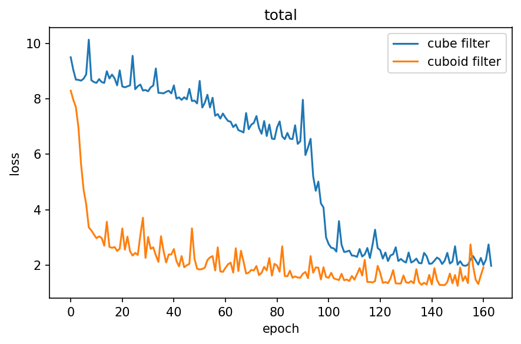

# Prediction-of-E-using-CNN

## Original Text

**Thesis**

[Predicting properties of porous structure using three-dimensional convolutional neural networks with cuboid filter](./docs/Final_Thesis.pdf)

**Progress Report**

[Progress Report](./docs/Progress_Report.pdf)

## Method

직사각형 모양의 필터를 사용한 3D CNN 으로 기공 구조의 물성을 예측

- Digimat 을 이용해 랜덤한 기공 구조를 생성하고, Mesh  데이터와 Young's Modulus 를 각각 저장
- 저장된 Mesh 데이터를 넘파이 배열로 변환, 데이터 전처리

- 3D CNN 을 사용해 학습 진행

## Result

- average error rate 

| cube filter | cuboid filter |
| ----------- | ------------- |
| 1.99 %      | 1.84 %        |

- 학습 양상 비교

- 기존의 방식 (Digimat 자체 제공 해석 툴 - CASI Iterative) 과의 연산 속도 비교

| FEM     | CNN     |
| ------- | ------- |
| 32.51 s | 0.047 s |

## Reference

- Yang, Zijiang, et al. "Deep learning approaches for mining structure-property linkages in high contrast composites from simulation datasets." Computational Materials Science 151 (2018): 278-287.

- Yang, Zijiang, et al. "Establishing structure-property localization linkages for elastic deformation of three-dimensional high contrast composites using deep learning approaches." Acta Materialia 166 (2019): 335-345.

- Cecen, Ahmet, et al. "Material structure-property linkages using three-dimensional convolutional neural networks." Acta Materialia 146 (2018): 76-84.

- Li, Xiang, et al. "Predicting the effective mechanical property of heterogeneous materials by image based modeling and deep learning." Computer Methods in Applied Mechanics and Engineering 347 (2019): 735-753.